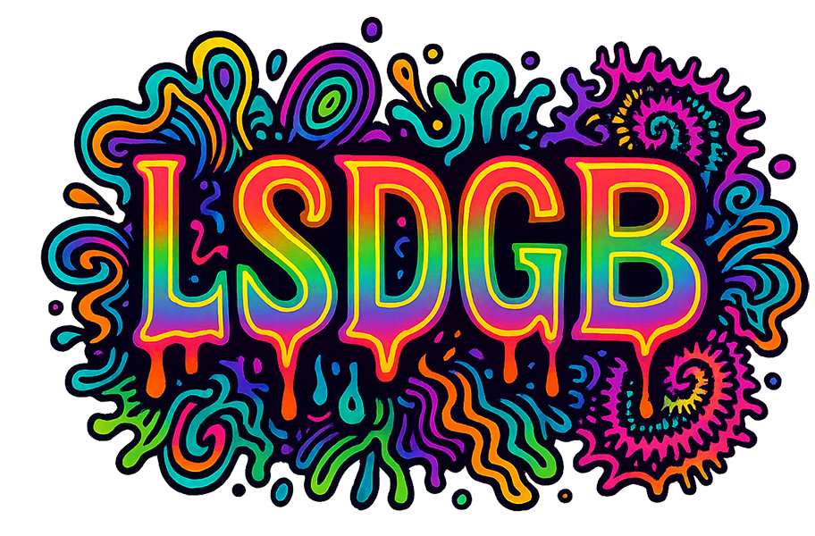

# LSDGB

A psychedelic arcade browser game inspired by classic shooters and trippy vibes.

## Play Online
You can play the game by opening `index.html` in your browser on desktop, mobile, or tablet devices.

## Game Description
- **LSDGB** ("LSD Gummy Bear") is a fast-paced, colorful shooter where you play as a groovy gummy bear fighting off conformity!
- **New Logo:** The start screen now features a vibrant, psychedelic LSDGB logo (`lsdgb-logo.png`) for a professional and eye-catching introduction.
- **4:3 Playable Area:** The game action is strictly confined to a central 4:3 area (960x720) within a widescreen 16:9 canvas (1280x720). The canvas always maintains a 4:3 aspect ratio, centered in the browser window, with sidebars or letterboxing as needed. This ensures the controls never overlap the playfield and the game never appears stretched or squished, regardless of device or window size.
- **Responsive, Cross-Device Design:** The game is fully responsive and works on desktops, laptops, tablets, and phones in any orientation. The canvas is always centered, and the play area is never distorted.
- **Controls Anchored to Corners:** The D-pad and fire button are now anchored to the absolute bottom-left and bottom-right corners of the screen, maximizing comfort and keeping the playfield completely unobstructed.
- **Maximized Distance & Size:** Both controls are as far from the playfield as possible and are larger for easy, ergonomic use.
- **Visual Boundaries:** Faint lines mark the edges of the playfield for clarity.
- **Life Gummy is Animated:** The extra-life gummy bear now uses a 2-frame animated sprite (`lifegummy1.png`, `lifegummy2.png`) for a lively effect, just like the player and enemies.
- **All Characters Use Sprites:** The player, suits, cops, hippies, angry suits, and life gummy all use 2-frame image-based sprites for smooth animation.
- Convert suits and cops into hippies with your acid vials.
- Collect life gummies to increase your lives. Reach 3 lives to win!
- **Dynamic difficulty**: Your fire rate and enemy spawn rate are tied to your score - the better you do, the faster you shoot and the more enemies spawn!
- **Tiled Background:** Both the grass (normal mode) and parking lot (hard mode) backgrounds are split into left, center, and right images for pixel-perfect seamless tiling. The play area is always clear, and the barriers are always flush with the playfield, regardless of screen size.

## Visual Polish & Accessibility
- **Psychedelic Logo:** The start screen features a custom, colorful logo (`lsdgb-logo.png`).
- **Modern Start Screen:** Difficulty buttons and instructions are visually balanced, with a clear "How to Play" panel and improved spacing.
- **Aspect Ratio Enforcement:** The game always appears in a classic, tall 4:3 area, never stretched or squished, for a consistent experience on all devices.
- **Canvas Centering:** The canvas is always centered in the browser window, with sidebars or letterboxing as needed.

## Sound Effects
- **p5.sound** is used for audio support.
- **shooting.mp3** is played every time the gummy bear shoots a rainbow ball of acid.
- **soundtrack.mp3** plays in a loop when the round begins, and stops on game over or win.
- **gummybear.mp3** plays when a LifeGummy (extra life) enters the playfield.
- **Recommended format:** MP3 (for best browser compatibility and performance).

## Controls
- **Desktop:**
  - **Move:** Arrow Keys or WASD
  - **Shoot:** Hold SPACEBAR to auto-shoot vibes
  - **Start/Restart:** Click the button or press ENTER
- **Mobile/Touch:**
  - **Move:** Use the large on-screen circular D-pad (anchored to the bottom-left corner, outside the playfield). Touch and drag in any direction for smooth 8-way movement. There is no dead zone—movement is active anywhere inside the D-pad. To stop, simply lift your thumb.
  - **Shoot:** Tap the red fire button (anchored to the bottom-right corner, outside the playfield)
  - **Start/Restart:** Tap the button or press ENTER
  - **Orientation:** The game works in any device orientation (portrait or landscape)

## How to Play
1. **Start the game** by clicking "START REVOLUTION" or pressing ENTER.
2. **Move** your gummy bear using keyboard (desktop) or the large circular D-pad (mobile) to dodge enemies and collect life gummies.
3. **Shoot** acid vials using spacebar (desktop) or the red fire button (mobile) to convert enemies into hippies.
4. **Collect 3 lives** to win. If you lose all your lives or your score drops below -5, the game is over.
5. **Life Gummy Strategy:** The extra-life gummy bear now takes 3 hits to destroy and is animated with 2 frames. It flashes white when hit, so plan your shots carefully to avoid losing your chance at an extra life!
6. **Watch your fire rate**: As your score increases, you'll shoot faster and enemies will spawn more frequently!

## Difficulty Levels

### Normal Mode
- Classic gameplay with standard difficulty.
- Grass background (`grass.png`).
- Player starts with 1 life, max 3 lives, win at 3.
- Life gummies and cops require 3 hits.
- Suits and angry suits have standard speed.
- Game over at -5 score.

### Hard Mode (New!)
- Increased enemy speed and spawn rate.
- Player starts with 1 life, max 2 lives, win at 4.
- Life gummies and cops require 3 hits.
- Angry suits move faster and chase more aggressively.
- Game over at -3 score.
- HUD is red for extra tension.
- **Parking lot background** (`parkinglot.png`) for a more intense vibe.
- **Unique soundtrack** (`soundtrack2.mp3`) for Hard Mode.
- **FormerCop**: When a Cop is converted, it becomes a FormerCop (not a hippie). FormerCops have unique slogans (e.g., "Werk It", "Rainbow!", etc.), a 2-frame animation, and float down the screen. If a Suit touches a FormerCop, the Suit is slowed for 3 seconds. FormerCops are allies and cannot be harmed.

## Game Features
- **4:3 Playable Area:** All gameplay is confined to a central 4:3 region, with controls in dedicated sidebars.
- **Controls Anchored to Corners:** D-pad and fire button are maximally distant from the playfield for comfort and visibility.
- **Visual Boundaries:** Faint lines show the playfield edges for clarity.
- **Life Gummy is Animated:** Extra-life gummies use a 2-frame sprite and require three hits (five in hard mode), flashing white when damaged.
- **All Characters Animated:** Player, suits, cops, hippies, angry suits, and life gummy all use 2-frame image-based sprites for smooth animation.
- **Dynamic Fire Rate**: Your shooting speed increases with your score
- **Adaptive Spawning**: Enemy spawn rate increases as you perform better
- **Life System**: Collect gummy life power-ups every 25 points
- **Enemy Types**: 
  - **Suits**: Convert to hippies with 1 hit
  - **Cops**: Require 3 hits to convert, and can revert hippies back to angry suits! (Note: Only hippies that originated as Suits can be reverted. This logic could be adapted for an 'ultra boss' scenario in future versions.)
- **Responsive Canvas**: Game scales perfectly on any screen size
- **Touch Support**: Full mobile and tablet support with a professional, large, corner-anchored circular D-pad (no dead zone, visual feedback) and a dedicated fire button
- **Any Orientation**: Works in portrait or landscape mode on mobile devices
- **Tiled Background:** The grass background is tiled vertically to fill the browser window in normal mode; the parking lot background is used in hard mode.

## Enemies & Allies
- **Suit**: Standard enemy. Converts to a hippie with 1 hit.
- **Cop**: Requires 3 hits to convert. When converted, becomes a FormerCop (not a hippie).
- **Angry Suit**: Chases the player or life gummies more aggressively.
- **Convict**: Created when a hippie (originating from a cop) is hit by a cop. Convicts chase the player or life gummies, are tough, and use a 2-frame animation (`convict1.png`, `convict2.png`).
- **FormerCop**: When a Cop is converted, it becomes a FormerCop. FormerCops have unique slogans, a 2-frame animation (`formercop1.png`, `formercop2.png`), and float down the screen. If a Suit touches a FormerCop, the Suit is slowed for 3 seconds. FormerCops are allies and cannot be harmed or harm the player.
- **Hippie**: Friendly, floats down the screen, cannot harm the player.

## Assets
- **All image and sound assets must be present in the project directory for full functionality:**
  - `lsdgb-logo.png` — Start screen logo
  - `gummy.png`, `suit1.png`, `suit2.png`, `cop1.png`, `cop2.png`, `hippie1.png`, `hippie2.png`, `angrysuit1.png`, `angrysuit2.png`, `lifegummy1.png`, `lifegummy2.png`
  - `grass-left.png`, `grass-center.png`, `grass-right.png` — Normal mode background (split for seamless tiling)
  - `parkinglot-left.png`, `parkinglot-center.png`, `parkinglot-right.png` — Hard mode background (split for seamless tiling)
  - `grass.png`, `parkinglot.png` (legacy, not used for tiling)
  - `convict1.png`, `convict2.png` — Convict 2-frame animation
  - `formercop1.png`, `formercop2.png` — FormerCop 2-frame animation
  - `shooting.mp3`, `soundtrack.mp3`, `soundtrack2.mp3`, `gummybear.mp3` — Sound effects and music